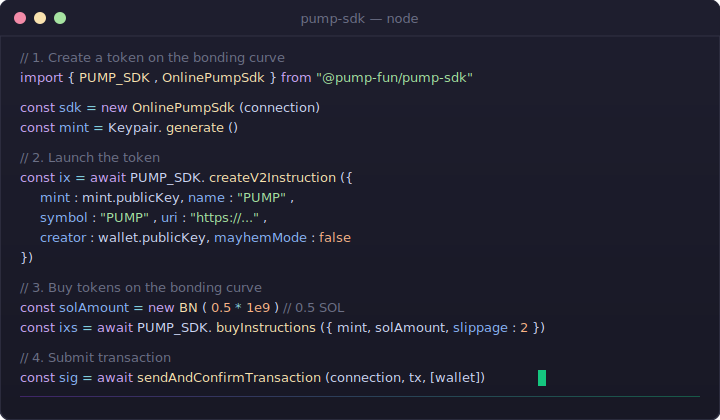

<div align="center">

<pre align="center">
██████╗ ██╗   ██╗███╗   ███╗██████╗     ███████╗██████╗ ██╗  ██╗
██╔══██╗██║   ██║████╗ ████║██╔══██╗    ██╔════╝██╔══██╗██║ ██╔╝
██████╔╝██║   ██║██╔████╔██║██████╔╝    ███████╗██║  ██║█████╔╝ 
██╔═══╝ ██║   ██║██║╚██╔╝██║██╔═══╝     ╚════██║██║  ██║██╔═██╗ 
██║     ╚██████╔╝██║ ╚═╝ ██║██║         ███████║██████╔╝██║  ██╗
╚═╝      ╚═════╝ ╚═╝     ╚═╝╚═╝         ╚══════╝╚═════╝ ╚═╝  ╚═╝
</pre>

<p>
  
</p>

<h3>A community TypeScript SDK for the <a href="https://pump.fun">Pump</a> protocol on Solana</h3>

<p>
Token Creation &nbsp;·&nbsp; Bonding Curves &nbsp;·&nbsp; AMM Trading &nbsp;·&nbsp; Liquidity &nbsp;·&nbsp; Fee Sharing &nbsp;·&nbsp; Cashback &nbsp;·&nbsp; Social Fees<br>
<strong>Create, trade, provide liquidity, and manage fees — all from TypeScript.</strong><br>
<em>Now with real-time WebSocket relay, live dashboards, Telegram bot, and social fee integrations.</em>
</p>

<p>
  <a href="https://www.npmjs.com/package/@pump-fun/pump-sdk"></a>&nbsp;
  <a href="https://www.npmjs.com/package/@pump-fun/pump-sdk"></a>&nbsp;
  <a href="LICENSE"></a>&nbsp;
  <a href="https://github.com/nirholas/pump-fun-sdk"></a>
</p>

<p>
  <a href="https://solana.com"></a>&nbsp;
  <a href="src/"></a>&nbsp;
  <a href="mcp-server/"></a>&nbsp;
  <a href="rust/"></a>&nbsp;
  <a href="websocket-server/"></a>&nbsp;
  <a href="telegram-bot/"></a>&nbsp;
  <a href="live/"></a>
</p>

<br>

[**Docs**](docs/getting-started.md) &nbsp;·&nbsp; [**Ecosystem**](docs/ecosystem.md) &nbsp;·&nbsp; [**npm**](https://www.npmjs.com/package/@pump-fun/pump-sdk) &nbsp;·&nbsp; [**API Ref**](docs/api-reference.md) &nbsp;·&nbsp; [**Examples**](docs/examples.md) &nbsp;·&nbsp; [**Tutorials**](tutorials/) &nbsp;·&nbsp; [**MCP Server**](mcp-server/) &nbsp;·&nbsp; [**Telegram Bot**](telegram-bot/) &nbsp;·&nbsp; [**Live Dashboard**](live/)

</div>

---

<div align="center">

### ⚡ See it in action

<picture>
  <source media="(prefers-color-scheme: dark)" srcset=".github/demo.svg">
  <source media="(prefers-color-scheme: light)" srcset=".github/demo.svg">
  
</picture>

</div>

---

### 📖 Table of Contents

- [Why Pump SDK?](#-why-pump-sdk) — What makes it different
- [Quick Start (30 seconds)](#-quick-start) — Copy-paste and go
- [Installation](#-installation) — npm, yarn, or pnpm
- [Token Lifecycle](#-token-lifecycle) — Bonding curve → graduation → AMM
- [Usage Examples](#-usage) — Create, buy, sell, AMM, fees, cashback
- [Analytics](#-analytics) — Price impact, graduation, token price
- [Architecture](#-architecture) — Offline & online SDK layers
- [Programs](#-programs) — 4 on-chain program addresses
- [WebSocket Relay](#-websocket-relay-server) — Real-time token launch feed
- [Live Dashboards](#-live-dashboards) — Browser-based monitoring
- [MCP Server](#-mcp-server) — 53 tools for AI agents
- [Telegram Bot](#-telegram-bot--api) — Fee claim & CTO alerts
- [PumpOS Web Desktop](#-pumpos-web-desktop) — 169 Pump-Store apps
- [x402 Payments](#-x402-payment-protocol) — HTTP 402 micropayments
- [DeFi Agents](#-defi-agents) — 43 production-ready AI agent definitions
- [Lair Platform](#-lair-telegram-platform) — Unified DeFi Telegram bot
- [Plugin.delivery](#-plugindelivery) — 17 AI plugin APIs for SperaxOS
- [Vanity Generators](#-vanity-address-generators) — Rust (100K+ keys/sec) + TypeScript
- [Scripts & Makefile](#️-shell-scripts--makefile) — Production CLI tools
- [Testing & CI/CD](#-testing--cicd) — 6 GitHub Actions workflows
- [Tutorials](#-tutorials) — 35 hands-on guides
- [Documentation](#-documentation) — Full guides and references
- [Contributing](#-contributing) — Help make Pump SDK better

---

## 🏆 Why Pump SDK?

<table>
<tr>
<td></td>
<td align="center"><strong>Pump SDK</strong></td>
<td align="center"><strong>Manual RPC</strong></td>
<td align="center"><strong>Generic DEX SDKs</strong></td>
</tr>
<tr><td><strong>Bonding curve math</strong></td><td align="center">✅ Built-in</td><td align="center">❌ DIY</td><td align="center">❌ Not supported</td></tr>
<tr><td><strong>Token graduation</strong></td><td align="center">✅ Automatic</td><td align="center">❌ DIY</td><td align="center">❌ Not supported</td></tr>
<tr><td><strong>AMM liquidity</strong></td><td align="center">✅ Deposit & withdraw</td><td align="center">❌ DIY</td><td align="center">⚠️ Limited</td></tr>
<tr><td><strong>Fee sharing</strong></td><td align="center">✅ Up to 10 shareholders</td><td align="center">❌ DIY</td><td align="center">❌ Not supported</td></tr>
<tr><td><strong>Cashback rewards</strong></td><td align="center">✅ Pump + AMM</td><td align="center">❌ DIY</td><td align="center">❌ Not supported</td></tr>
<tr><td><strong>Social fee PDAs</strong></td><td align="center">✅ Create & claim</td><td align="center">❌ DIY</td><td align="center">❌ Not supported</td></tr>
<tr><td><strong>Volume rewards</strong></td><td align="center">✅ Track & claim</td><td align="center">❌ DIY</td><td align="center">❌ Not supported</td></tr>
<tr><td><strong>Offline mode</strong></td><td align="center">✅ No connection needed</td><td align="center">❌ Always online</td><td align="center">⚠️ Partial</td></tr>
<tr><td><strong>TypeScript types</strong></td><td align="center">✅ Full IDL types</td><td align="center">❌ None</td><td align="center">⚠️ Partial</td></tr>
<tr><td><strong>Analytics</strong></td><td align="center">✅ Price impact, graduation</td><td align="center">❌ DIY</td><td align="center">⚠️ Partial</td></tr>
<tr><td><strong>MCP server</strong></td><td align="center">✅ 53 tools for AI agents</td><td align="center">❌</td><td align="center">❌</td></tr>
<tr><td><strong>Real-time feed</strong></td><td align="center">✅ WebSocket relay</td><td align="center">❌ DIY</td><td align="center">❌</td></tr>
<tr><td><strong>Telegram bot</strong></td><td align="center">✅ Claims + CTO + API</td><td align="center">❌</td><td align="center">❌</td></tr>
<tr><td><strong>DeFi agents</strong></td><td align="center">✅ 43 agent definitions</td><td align="center">❌</td><td align="center">❌</td></tr>
<tr><td><strong>x402 payments</strong></td><td align="center">✅ HTTP 402 + USDC</td><td align="center">❌</td><td align="center">❌</td></tr>
<tr><td><strong>Tutorials</strong></td><td align="center">✅ 35 guides</td><td align="center">❌</td><td align="center">❌</td></tr>
<tr><td><strong>4 programs</strong></td><td align="center">✅ Pump + AMM + Fees + Mayhem</td><td align="center">⚠️ Manual</td><td align="center">❌ Not supported</td></tr>
</table>

---

## ✨ Features

<table>
<tr>
<td width="50%">

**🚀 Token Creation**
- Launch tokens on bonding curves with one instruction
- Create + buy atomically in a single transaction
- Mayhem mode for alternate routing
- Cashback opt-in at creation time

</td>
<td width="50%">

**📈 Trading**
- Buy & sell on bonding curves with slippage protection
- AMM buy, sell, exact-quote-in for graduated tokens
- Buy with exact SOL input (`buyExactSolIn`)
- Automatic graduated token detection

</td>
</tr>
<tr>
<td width="50%">

**💱 AMM Liquidity**
- Deposit into graduated AMM pools
- Withdraw liquidity with min-amount guards
- Migrate pool creator between wallets
- Transfer creator fees from AMM → Pump vault

</td>
<td width="50%">

**💰 Fee System**
- Collect creator fees across both programs
- Split fees among up to 10 shareholders
- Market-cap-based fee tiers (upsert dynamically)
- Transfer, revoke, or reset fee-sharing authority

</td>
</tr>
<tr>
<td width="50%">

**🎁 Rewards & Cashback**
- Volume rewards — earn tokens from trading SOL
- Cashback — claim on both Pump and AMM programs
- Social fee PDAs — per-user/platform fee accounts
- Track daily & cumulative rewards

</td>
<td width="50%">

**🔧 Developer Experience**
- Offline SDK — no connection needed for instructions
- Online SDK — fetch state + build transactions
- 42 instruction builders, full TypeScript types via Anchor IDL
- 53 MCP tools for AI assistant integration

</td>
</tr>
<tr>
<td width="50%">

**📊 Analytics**
- Price impact calculation (buy & sell)
- Graduation progress tracking
- Token price quoting
- Bonding curve summaries

</td>
<td width="50%">

**📡 Real-Time & Payments**
- WebSocket relay for live token launches
- Live trading dashboards with analytics
- Telegram bot: fee claims, CTO, whale, graduation alerts
- x402 HTTP 402 micropayments (Solana USDC)
- Lair: unified DeFi intelligence bot platform
- 35 hands-on tutorials covering every feature

</td>
</tr>
</table>

---

## 📦 Installation

<table>
<tr>
<td><strong>npm</strong></td>
<td>

```bash
npm install @pump-fun/pump-sdk
```

</td>
</tr>
<tr>
<td><strong>yarn</strong></td>
<td>

```bash
yarn add @pump-fun/pump-sdk
```

</td>
</tr>
<tr>
<td><strong>pnpm</strong></td>
<td>

```bash
pnpm add @pump-fun/pump-sdk
```

</td>
</tr>
</table>

### Peer Dependencies

```bash
npm install @solana/web3.js @coral-xyz/anchor @solana/spl-token bn.js
```

---

## 🚀 Quick Start

```typescript
import { Connection, Keypair, Transaction, sendAndConfirmTransaction } from "@solana/web3.js";
import BN from "bn.js";
import {
  OnlinePumpSdk,
  PUMP_SDK,
  getBuyTokenAmountFromSolAmount,
} from "@pump-fun/pump-sdk";

// 1. Connect
const connection = new Connection("https://api.devnet.solana.com", "confirmed");
const sdk = new OnlinePumpSdk(connection);

// 2. Create a token and buy in one transaction
const mint = Keypair.generate();
const global = await sdk.fetchGlobal();
const feeConfig = await sdk.fetchFeeConfig();
const solAmount = new BN(0.5 * 1e9); // 0.5 SOL

const tokenAmount = getBuyTokenAmountFromSolAmount({
  global, feeConfig, mintSupply: null, bondingCurve: null, amount: solAmount,
});

const instructions = await PUMP_SDK.createV2AndBuyInstructions({
  global,
  mint: mint.publicKey,
  name: "My Token",
  symbol: "MTK",
  uri: "https://example.com/metadata.json",
  creator: wallet.publicKey,
  user: wallet.publicKey,
  amount: tokenAmount,
  solAmount,
  mayhemMode: false,
});

// 3. Send it
const tx = new Transaction().add(...instructions);
const sig = await sendAndConfirmTransaction(connection, tx, [wallet, mint]);
console.log("Created & bought:", sig);
```

> [!TIP]
> **🤖 AI Coding Assistants:** Building on Pump protocol?
> - `npm install @pump-fun/pump-sdk` — Token creation, trading, fee sharing
> - Works with Claude, GPT, Cursor via [MCP server](mcp-server/)
> - See [AGENTS.md](AGENTS.md) for integration instructions

---

## 🔄 Token Lifecycle

```
┌─────────────────────────┐                          ┌───────────────────────┐
│     Bonding Curve        │    graduation           │      AMM Pool         │
│     (Pump Program)       │ ─────────────────────►  │      (PumpAMM Program │
│                          │   complete = true       │                       │
│  • createV2              │                         │  • Pool-based swap    │
│  • buy / sell            │                         │  • LP fees            │
│  • Price discovery       │                         │  • Graduated trading  │
└─────────────────────────┘                          └───────────────────────┘
```

<br>

| Phase | What Happens | SDK Method |
|-------|-------------|------------|
| **1. Create** | Token starts on a bonding curve | `createV2Instruction()` |
| **2. Trade** | Users buy & sell; price follows the curve | `buyInstructions()` / `sellInstructions()` |
| **3. Graduate** | `bondingCurve.complete` becomes `true` | Auto-detected |
| **4. Migrate** | Token moves to an AMM pool | `migrateInstruction()` |
| **5. AMM Trade** | Pool-based buy & sell | `ammBuyInstruction()` / `ammSellInstruction()` |
| **6. LP** | Deposit/withdraw liquidity | `ammDepositInstruction()` / `ammWithdrawInstruction()` |
| **7. Fees** | Collect & share creator fees | `collectCoinCreatorFeeInstructions()` |
| **8. Rewards** | Volume rewards + cashback | `claimTokenIncentivesBothPrograms()` |

---

## 💻 Usage

<div align="center">
  
</div>

### Create a Token

```typescript
import { Keypair } from "@solana/web3.js";
import { PUMP_SDK } from "@pump-fun/pump-sdk";

const mint = Keypair.generate();

const instruction = await PUMP_SDK.createV2Instruction({
  mint: mint.publicKey,
  name: "My Token",
  symbol: "MTK",
  uri: "https://example.com/metadata.json",
  creator: wallet.publicKey,
  user: wallet.publicKey,
  mayhemMode: false,
});
```

<details>
<summary><strong>Create + Buy atomically</strong></summary>

```typescript
import BN from "bn.js";
import { getBuyTokenAmountFromSolAmount } from "@pump-fun/pump-sdk";

const global = await sdk.fetchGlobal();
const feeConfig = await sdk.fetchFeeConfig();
const solAmount = new BN(0.5 * 1e9); // 0.5 SOL

const tokenAmount = getBuyTokenAmountFromSolAmount({
  global, feeConfig, mintSupply: null, bondingCurve: null, amount: solAmount,
});

const instructions = await PUMP_SDK.createV2AndBuyInstructions({
  global,
  mint: mint.publicKey,
  name: "My Token",
  symbol: "MTK",
  uri: "https://example.com/metadata.json",
  creator: wallet.publicKey,
  user: wallet.publicKey,
  amount: tokenAmount,
  solAmount,
  mayhemMode: false,
});

const tx = new Transaction().add(...instructions);
const sig = await sendAndConfirmTransaction(connection, tx, [wallet, mint]);
```
</details>

### Buy Tokens

```typescript
import BN from "bn.js";
import { getBuyTokenAmountFromSolAmount, PUMP_SDK } from "@pump-fun/pump-sdk";

const mint = new PublicKey("...");
const user = wallet.publicKey;
const solAmount = new BN(0.1 * 1e9); // 0.1 SOL

const global = await sdk.fetchGlobal();
const feeConfig = await sdk.fetchFeeConfig();
const { bondingCurveAccountInfo, bondingCurve, associatedUserAccountInfo } =
  await sdk.fetchBuyState(mint, user);

const tokenAmount = getBuyTokenAmountFromSolAmount({
  global, feeConfig,
  mintSupply: bondingCurve.tokenTotalSupply,
  bondingCurve, amount: solAmount,
});

const instructions = await PUMP_SDK.buyInstructions({
  global, bondingCurveAccountInfo, bondingCurve, associatedUserAccountInfo,
  mint, user, solAmount, amount: tokenAmount,
  slippage: 2, // 2% slippage tolerance
});
```

### Sell Tokens

```typescript
import { getSellSolAmountFromTokenAmount, PUMP_SDK } from "@pump-fun/pump-sdk";

const { bondingCurveAccountInfo, bondingCurve } = await sdk.fetchSellState(mint, user);
const sellAmount = new BN(15_828);

const instructions = await PUMP_SDK.sellInstructions({
  global, bondingCurveAccountInfo, bondingCurve, mint, user,
  amount: sellAmount,
  solAmount: getSellSolAmountFromTokenAmount({
    global, feeConfig,
    mintSupply: bondingCurve.tokenTotalSupply,
    bondingCurve, amount: sellAmount,
  }),
  slippage: 1,
});
```

### Creator Fees

```typescript
// Check accumulated fees across both programs
const balance = await sdk.getCreatorVaultBalanceBothPrograms(wallet.publicKey);
console.log("Creator fees:", balance.toString(), "lamports");

// Collect fees
const instructions = await sdk.collectCoinCreatorFeeInstructions(wallet.publicKey);
```

<details>
<summary><strong>Fee Sharing — split fees among shareholders</strong></summary>

Split creator fees among up to 10 shareholders. See the full [Fee Sharing Guide](docs/fee-sharing.md).

```typescript
import { PUMP_SDK, isCreatorUsingSharingConfig } from "@pump-fun/pump-sdk";

// 1. Create a sharing config
const ix = await PUMP_SDK.createFeeSharingConfig({ creator: wallet.publicKey, mint, pool: null });

// 2. Set shareholders (shares must total 10,000 bps = 100%)
const ix2 = await PUMP_SDK.updateFeeShares({
  authority: wallet.publicKey,
  mint,
  currentShareholders: [],
  newShareholders: [
    { address: walletA, shareBps: 5000 }, // 50%
    { address: walletB, shareBps: 3000 }, // 30%
    { address: walletC, shareBps: 2000 }, // 20%
  ],
});

// 3. Check & distribute
const result = await sdk.getMinimumDistributableFee(mint);
if (result.canDistribute) {
  const { instructions } = await sdk.buildDistributeCreatorFeesInstructions(mint);
  const tx = new Transaction().add(...instructions);
}
```
</details>

<details>
<summary><strong>Token Incentives — earn rewards from trading volume</strong></summary>

Earn token rewards based on SOL trading volume. See the full [Token Incentives Guide](docs/token-incentives.md).

```typescript
import { PUMP_SDK } from "@pump-fun/pump-sdk";

// Initialize volume tracking (one-time)
const ix = await PUMP_SDK.initUserVolumeAccumulator({
  payer: wallet.publicKey,
  user: wallet.publicKey,
});

// Check unclaimed rewards
const rewards = await sdk.getTotalUnclaimedTokensBothPrograms(wallet.publicKey);
console.log("Unclaimed rewards:", rewards.toString());

// Claim rewards
const instructions = await sdk.claimTokenIncentivesBothPrograms(
  wallet.publicKey, wallet.publicKey,
);
```
</details>

<details>
<summary><strong>AMM Trading — buy & sell graduated tokens</strong></summary>

After a token graduates to the AMM, use pool-based trading:

```typescript
import { PUMP_SDK, canonicalPumpPoolPda } from "@pump-fun/pump-sdk";

const pool = canonicalPumpPoolPda(mint);

// Buy on AMM
const buyIx = await PUMP_SDK.ammBuyInstruction({
  pool,
  user: wallet.publicKey,
  baseAmountOut: new BN(1_000_000), // tokens to receive
  maxQuoteAmountIn: new BN(0.1 * 1e9), // max SOL to spend
});

// Sell on AMM
const sellIx = await PUMP_SDK.ammSellInstruction({
  pool,
  user: wallet.publicKey,
  baseAmountIn: new BN(1_000_000), // tokens to sell
  minQuoteAmountOut: new BN(0.05 * 1e9), // min SOL to receive
});

// Deposit liquidity
const depositIx = await PUMP_SDK.ammDepositInstruction({
  pool,
  user: wallet.publicKey,
  baseTokenAmount: new BN(10_000_000),
  quoteTokenAmount: new BN(1 * 1e9),
  minLpTokenAmount: new BN(1),
});

// Withdraw liquidity
const withdrawIx = await PUMP_SDK.ammWithdrawInstruction({
  pool,
  user: wallet.publicKey,
  lpTokenAmount: new BN(100_000),
  minBaseTokenAmount: new BN(1),
  minQuoteTokenAmount: new BN(1),
});
```
</details>

<details>
<summary><strong>Cashback — claim trading rebates</strong></summary>

Claim cashback rewards accrued from trading with cashback-enabled tokens:

```typescript
// Claim from Pump program
const pumpCashback = await PUMP_SDK.claimCashbackInstruction({
  user: wallet.publicKey,
});

// Claim from AMM program
const ammCashback = await PUMP_SDK.ammClaimCashbackInstruction({
  user: wallet.publicKey,
});
```
</details>

<details>
<summary><strong>Social Fee PDAs — platform-aware fee accounts</strong></summary>

Create and claim social fee PDAs for platform integrations:

```typescript
// Create a social fee PDA for a user on a platform
const createSocialFee = await PUMP_SDK.createSocialFeePdaInstruction({
  payer: wallet.publicKey,
  userId: "user123",
  platform: "twitter",
});

// Claim social fee PDA
const claimSocialFee = await PUMP_SDK.claimSocialFeePdaInstruction({
  claimAuthority: wallet.publicKey,
  recipient: wallet.publicKey,
  userId: "user123",
  platform: "twitter",
});
```
</details>

---

## 📊 Analytics

Offline pure functions for price analysis — no RPC calls needed.

```typescript
import {
  calculateBuyPriceImpact,
  calculateSellPriceImpact,
  getGraduationProgress,
  getTokenPrice,
  getBondingCurveSummary,
} from "@pump-fun/pump-sdk";

// Price impact of buying 1 SOL worth
const impact = calculateBuyPriceImpact({
  global, feeConfig, mintSupply: bondingCurve.tokenTotalSupply,
  bondingCurve, solAmount: new BN(1e9),
});
console.log(`Impact: ${impact.impactBps} bps, tokens: ${impact.outputAmount}`);

// How close to graduation?
const progress = getGraduationProgress(global, bondingCurve);
console.log(`${(progress.progressBps / 100).toFixed(1)}% graduated`);

// Current price per token
const price = getTokenPrice({ global, feeConfig, mintSupply: bondingCurve.tokenTotalSupply, bondingCurve });
console.log(`Buy: ${price.buyPricePerToken} lamports/token`);

// Full summary in one call
const summary = getBondingCurveSummary({ global, feeConfig, mintSupply: bondingCurve.tokenTotalSupply, bondingCurve });
```

---

## 🏗️ Architecture

<div align="center">
  
</div>

The SDK is split into two layers:

```
┌──────────────────────────────────────────────────────────────────┐
│                        Your Application                          │
├──────────────────────────────┬───────────────────────────────────┤
│      PumpSdk (Offline)       │      OnlinePumpSdk (Online)       │
│                              │                                   │
│  • 42 instruction builders   │  • Fetch on-chain state           │
│  • Decode accounts           │  • Simulate transactions          │
│  • Pure computation          │  • *BothPrograms variants         │
│  • No connection needed      │  • Wraps PumpSdk + Connection     │
│                              │                                   │
│  Export: PUMP_SDK singleton   │  Export: OnlinePumpSdk class      │
├──────────────────────────────┴───────────────────────────────────┤
│  bondingCurve.ts │ analytics.ts │ fees.ts │ pda.ts │ state.ts │ tokenIncentives.ts │
│  tokenIncentives.ts │ errors.ts                                  │
├──────────────────────────────────────────────────────────────────┤
│     Anchor IDLs: pump │ pump_amm │ pump_fees │ mayhem            │
└──────────────────────────────────────────────────────────────────┘
```

<details>
<summary><strong>Module map</strong></summary>

```
src/
├── index.ts            # Public API — re-exports everything
├── sdk.ts              # PumpSdk — 42 instruction builders, 14 account decoders, 27 event decoders
├── onlineSdk.ts        # OnlinePumpSdk — fetchers + BothPrograms aggregators
├── bondingCurve.ts     # Pure math for price quoting
├── analytics.ts        # Price impact, graduation progress, token price, bonding curve summary
├── fees.ts             # Fee tier calculation logic
├── errors.ts           # Custom error classes
├── pda.ts              # PDA derivation helpers (incl. socialFeePda)
├── state.ts            # 40+ TypeScript types for on-chain accounts & events
├── tokenIncentives.ts  # Volume-based reward calculations
└── idl/                # Anchor IDLs for all three programs
    ├── pump.ts / pump.json           # 29 instructions
    ├── pump_amm.ts / pump_amm.json   # 25 instructions
    └── pump_fees.ts / pump_fees.json # 17 instructions
```
</details>

---

## 🔗 Programs

The SDK interacts with four on-chain Solana programs:

| Program | Address | Purpose |
|---------|---------|---------|
| **Pump** | `6EF8rrecthR5Dkzon8Nwu78hRvfCKubJ14M5uBEwF6P` | Token creation, bonding curve buy/sell |
| **PumpAMM** | `pAMMBay6oceH9fJKBRHGP5D4bD4sWpmSwMn52FMfXEA` | AMM pools for graduated tokens |
| **PumpFees** | `pfeeUxB6jkeY1Hxd7CsFCAjcbHA9rWtchMGdZ6VojVZ` | Fee sharing configuration & distribution |
| **Mayhem** | `MAyhSmzXzV1pTf7LsNkrNwkWKTo4ougAJ1PPg47MD4e` | Alternate routing mode |

---

## 📡 WebSocket Relay Server

The [WebSocket relay server](websocket-server/) connects to PumpFun's API, parses new token launches, and broadcasts structured events to browser clients.

```bash
cd websocket-server && npm install && npm run dev
```

**Architecture:** `PumpFun API ◀── SolanaMonitor ──▶ Relay Server (:3099/ws) ──▶ Browsers`

**Production:** `wss://pump-fun-websocket-production.up.railway.app/ws`

See [websocket-server/README.md](websocket-server/README.md) for setup, message format, and deployment.

---

## 📊 Live Dashboards

Two standalone dashboards in [`live/`](live/) for real-time PumpFun monitoring — powered by the WebSocket relay:

| Dashboard | File | Description |
|-----------|------|-------------|
| **Token Launches** | `live/index.html` | Decodes full Anchor `CreateEvent` data — name, symbol, creator, market cap |
| **Trades** | `live/trades.html` | Real-time buy/sell feed with analytics, volume charts, whale detection |

Both support multi-endpoint failover and custom RPC endpoint input.

---

## 🤖 MCP Server

The included [MCP server](mcp-server/) exposes **53 tools** to AI assistants like Claude, GPT, and Cursor — covering the full Pump protocol plus wallet operations.

```bash
cd mcp-server && npm install && npm run build
```

<details>
<summary><strong>Full tool reference (53 tools)</strong></summary>

| Category | Tools |
|----------|-------|
| **Wallet** | `generate_keypair`, `generate_vanity`, `sign_message`, `verify_signature`, `validate_address`, `estimate_vanity_time`, `restore_keypair` |
| **Price Quoting** | `quote_buy`, `quote_sell`, `quote_buy_cost` |
| **Bonding Curve** | `get_market_cap`, `get_bonding_curve` |
| **Token Lifecycle** | `build_create_token`, `build_create_and_buy`, `build_buy`, `build_sell`, `build_sell_all`, `build_buy_exact_sol`, `build_migrate` |
| **Fee System** | `calculate_fees`, `get_fee_tier`, `build_create_fee_sharing`, `build_update_fee_shares`, `build_distribute_fees`, `get_creator_vault_balance`, `build_collect_creator_fees` |
| **Social Fees** | `build_create_social_fee`, `build_claim_social_fee`, `build_reset_fee_sharing`, `build_transfer_fee_authority`, `build_revoke_fee_authority` |
| **Token Incentives** | `build_init_volume_tracker`, `build_claim_incentives`, `get_unclaimed_rewards`, `get_volume_stats` |
| **Analytics** | `get_price_impact`, `get_graduation_progress`, `get_token_price`, `get_token_summary`, `is_graduated`, `get_token_balance` |
| **AMM Trading** | `build_amm_buy`, `build_amm_sell`, `build_amm_buy_exact_quote` |
| **AMM Liquidity** | `build_amm_deposit`, `build_amm_withdraw` |
| **Cashback** | `build_claim_cashback`, `build_amm_claim_cashback` |
| **Creator** | `build_migrate_creator` |
| **State / PDAs** | `derive_pda`, `fetch_global_state`, `fetch_fee_config`, `get_program_ids` |

</details>

Deploys to Railway, Cloudflare Workers, or Vercel. See [mcp-server/README.md](mcp-server/README.md) for setup.

---

## 📡 Telegram Bot + API

The included [Telegram bot](telegram-bot/) monitors PumpFun activity on Solana with real-time notifications:

- **Fee claims & cashback** — Track creator fee claims and cashback rewards for watched wallets
- **CTO alerts** — Detect creator fee redirection (creator takeover) events
- **Token launch monitor** — Real-time detection of new token mints with cashback coin flag
- **🎓 Graduation alerts** — Notifies when a token completes its bonding curve or migrates to PumpAMM
- **🐋 Whale trade alerts** — Configurable SOL threshold for large buy/sell notifications with progress bar
- **💎 Fee distribution alerts** — Tracks creator fee distributions to shareholders with share breakdown

**10 commands:**

| Command | Description |
|---------|-------------|
| `/start` | Welcome message and quick start |
| `/help` | Full command reference |
| `/watch <address>` | Watch a wallet for fee claims |
| `/unwatch <address>` | Stop watching a wallet |
| `/list` | Show all watched wallets |
| `/status` | Connection health and uptime |
| `/cto [mint\|wallet]` | Query Creator Takeover events |
| `/alerts [type] [on\|off]` | Toggle launch, graduation, whale, fee alerts |
| `/monitor` | Start the event monitor |
| `/stopmonitor` | Stop the event monitor |

Also ships a **REST API** for programmatic access: per-client watches, paginated claim queries, SSE streaming, and HMAC-signed webhooks.

```bash
# Bot only
cd telegram-bot && npm install && npm run dev

# Bot + API
npm run dev:full

# API only (no Telegram)
npm run api
```

See [telegram-bot/README.md](telegram-bot/README.md) for setup and API reference.

---

## 🌐 PumpOS Web Desktop

The [website](website/) is a static HTML/CSS/JS web desktop (PumpOS) featuring:

- **169 Pump-Store apps** — DeFi dashboards, trading tools, charts, wallets, Pump SDK tools, and more
- **Live trades dashboard** — real-time token launches and trades via WebSocket relay
- **PWA support** — service worker (`sw.js`), installable web manifest, offline capability
- **Wallet connect** — in-browser Solana wallet management
- **Smart money tracking** — on-chain whale and smart money analytics
- **Command palette** — keyboard-driven navigation and search
- **Plugin system** — extensible via `plugin-demo.html`
- **BIOS boot screen** — animated startup sequence at `bios.html`
- **Built-in API** — serverless endpoints for coins, market data, and portfolio
- **Bonding curve calculator** — interactive constant-product AMM price simulation
- **Fee tier explorer** — visualize market-cap-based tiered fee schedules
- **Token launch simulator** — animated token lifecycle from creation to graduation
- **SDK API reference** — interactive documentation for all 42 SDK methods

```
website/
├── index.html          # PumpOS desktop shell
├── live.html           # Live token launches + trades dashboard
├── chart.html          # Chart application
├── bios.html           # BIOS boot screen
├── plugin-demo.html    # Plugin system demo
├── sw.js               # Service worker (offline support)
├── Pump-Store/         # 169 installable apps
│   ├── apps/           # Individual app HTML files
│   └── db/v2.json      # App registry
├── scripts/            # 27 JS modules (wallet, widgets, kernel, etc.)
├── api/                # Serverless API endpoints
└── assets/             # Images, icons, wallpapers
```

---

## 💳 x402 Payment Protocol

The [`x402/`](x402/) package implements [HTTP 402 Payment Required](https://developer.mozilla.org/en-US/docs/Web/HTTP/Status/402) as a real micropayment protocol using Solana USDC.

| Component | Description |
|-----------|-------------|
| **Server** | Express middleware (`x402Paywall`) gates any endpoint behind a USDC payment |
| **Client** | `X402Client` auto-pays when it receives a 402 response |
| **Facilitator** | Verifies and settles payments on-chain |

```typescript
import { x402Paywall } from "@pump-fun/x402";

app.use("/api/premium", x402Paywall({
  recipient: "YourWalletAddress...",
  amountUsdc: 0.01, // $0.01 per request
}));
```

See [x402/README.md](x402/README.md) for setup and examples.

---

## 🤖 DeFi Agents

The [`packages/defi-agents/`](packages/defi-agents/) directory ships **43 production-ready AI agent definitions** for DeFi, portfolio management, trading, and Web3 workflows.

- **Universal format** — works with any AI platform (Claude, GPT, LLaMA, local models)
- **18-language i18n** — full locale translations
- **RESTful API** — agents served from a static JSON API
- **Agent manifest** — `agents-manifest.json` registry with metadata, categories, and counts
- **Includes** — `pump-fun-sdk-expert` agent specialized for this SDK

```bash
# Browse agents
cat packages/defi-agents/agents-manifest.json | jq '.totalAgents'
# 43
```

---

## 🏰 Lair Telegram Platform

[`lair-tg/`](lair-tg/) is a unified Telegram bot platform for DeFi intelligence, non-custodial wallet management, and token launching.

- **6 packages** — `api`, `bot`, `launch`, `mcp`, `os`, `shared`
- **15+ data sources** — CoinGecko, DexScreener, GeckoTerminal, Birdeye, and more
- **AI assistant** — GPT-4o with function calling for market analysis
- **Token deployment** — launch tokens via bonding curve from Telegram
- **Alerts** — meme tracker, whale monitoring, price alerts

See [lair-tg/README.md](lair-tg/README.md) for architecture and setup.

---

## 🔌 Plugin.delivery

The [`packages/plugin.delivery/`](packages/plugin.delivery/) directory is an AI plugin index with a full SDK, gateway, and developer tools for building function-calling plugins.

- **17 API plugins** — pump-fun-sdk, coingecko, dexscreener, defillama, beefy, lido, 1inch, thegraph, ens-lookup, gas-estimator, phishing-detector, sanctions-check, contract-scanner, audit-checker, grants-finder, address-labels, gateway
- **Plugin SDK** — TypeScript SDK with React hooks (`usePluginSettings`, `usePluginState`, `useWatchPluginMessage`)
- **OpenAPI compatible** — auto-generated client from OpenAPI specs
- **Vercel edge deployment** — serverless API functions

See [packages/plugin.delivery/README.md](packages/plugin.delivery/README.md) for details.

---

## 🔑 Vanity Address Generators

Generate custom Solana addresses with a desired prefix or suffix — using the official `solana-sdk` (Rust) and `@solana/web3.js` (TypeScript).

| Generator | Directory | Performance | Use Case |
|-----------|-----------|-------------|----------|
| **Rust** | [`rust/`](rust/) | 100K+ keys/sec (multi-threaded, Rayon) | Production, long prefixes |
| **TypeScript** | [`typescript/`](typescript/) | ~1K keys/sec | Education, scripting, programmatic API |

```bash
# Rust generator
cd rust && cargo build --release
./target/release/pump-vanity --prefix pump --threads 8

# TypeScript generator
cd typescript && npm install && npm start -- --prefix pump
```

Both generators zeroize key material after use and write keypairs with `0600` permissions. See [rust/README.md](rust/README.md) and [typescript/README.md](typescript/README.md) for full documentation.

---

## 🛠️ Shell Scripts & Makefile

Production shell scripts in [`scripts/`](scripts/) wrapping `solana-keygen`:

| Script | Purpose |
|--------|---------|
| `generate-vanity.sh` | Single vanity address with optional GPG encryption |
| `batch-generate.sh` | Parallel batch generation with resume support |
| `verify-keypair.sh` | 7-point keypair integrity verification |
| `test-rust.sh` | Run Rust generator test suite |
| `publish-clawhub.sh` | Publish skills to ClawHub registry |
| `utils.sh` | Shared utility functions |

The [`Makefile`](Makefile) provides 20+ targets for the full workflow:

```bash
make generate PREFIX=pump          # Generate a vanity address
make batch PREFIX=pump COUNT=10    # Batch generate
make verify FILE=keypair.json      # Verify a keypair
make test                          # Run all tests
make help                          # Show all targets
```

---

## 🧪 Testing & CI/CD

**Test suites** in [`tests/`](tests/) covering unit, integration, stress, fuzz, and benchmark tests:

```
tests/
├── benchmarks/     # Performance comparison and scaling tests
├── cli/            # CLI generation and verification tests
├── integration/    # Output compatibility, security properties, keypair validity
├── stress/         # Rapid generation and long-running stability
├── fuzz/           # Fuzz testing for edge cases
└── fixtures/       # Shared test data
```

```bash
npm test                           # Run SDK unit tests (Jest)
make test                          # Run all test suites
bash docs/run-all-tests.sh         # Run comprehensive cross-language tests
```

**CI/CD** via 6 GitHub Actions workflows:

| Workflow | Trigger | Purpose |
|----------|---------|---------|
| `ci.yml` | Push/PR | Build & lint on Node 18, 20, 22 |
| `release.yml` | Tags | npm publish + Rust binary releases |
| `security.yml` | Push/PR | npm audit, cargo audit, CodeQL, dependency review |
| `docs.yml` | Push | Deploy documentation |
| `stale.yml` | Cron (daily) | Auto-close stale issues |
| `labels.yml` | Push | Sync issue labels |

---

## 📚 Tutorials

35 hands-on guides in [`tutorials/`](tutorials/) covering every SDK feature:

| # | Tutorial | Topics |
|---|----------|--------|
| 1 | [Create a Token](tutorials/01-create-token.md) | `createV2Instruction`, metadata, signing |
| 2 | [Buy Tokens](tutorials/02-buy-tokens.md) | Bonding curve buy, slippage, `fetchBuyState` |
| 3 | [Sell Tokens](tutorials/03-sell-tokens.md) | Sell math, partial sells, `fetchSellState` |
| 4 | [Create + Buy](tutorials/04-create-and-buy.md) | Atomic create-and-buy in one transaction |
| 5 | [Bonding Curve Math](tutorials/05-bonding-curve-math.md) | Virtual reserves, price formulas, market cap |
| 6 | [Migration](tutorials/06-migration.md) | Graduation detection, AMM migration |
| 7 | [Fee Sharing](tutorials/07-fee-sharing.md) | Shareholder config, distribution, BPS |
| 8 | [Token Incentives](tutorials/08-token-incentives.md) | Volume rewards, accumulator, claiming |
| 9 | [Fee System](tutorials/09-fee-system.md) | Fee tiers, market-cap thresholds |
| 10 | [PDAs](tutorials/10-working-with-pdas.md) | Program Derived Addresses, derivation |
| 11 | [Trading Bot](tutorials/11-trading-bot.md) | Automated buy/sell strategies |
| 12 | [Offline vs Online](tutorials/12-offline-vs-online.md) | `PumpSdk` vs `OnlinePumpSdk` patterns |
| 13 | [Vanity Addresses](tutorials/13-vanity-addresses.md) | Rust + TS + CLI vanity generation |
| 14 | [x402 Paywalled APIs](tutorials/14-x402-paywalled-apis.md) | HTTP 402 USDC micropayments |
| 15 | [Decoding Accounts](tutorials/15-decoding-accounts.md) | On-chain account deserialization |
| 16 | [Monitoring Claims](tutorials/16-monitoring-claims.md) | Fee claim monitoring patterns |
| 17 | [Monitoring Website](tutorials/17-monitoring-website.md) | Live dashboard, real-time UI |
| 18 | [Telegram Bot](tutorials/18-telegram-bot.md) | Bot setup, commands, alerts |
| 19 | [CoinGecko Integration](tutorials/19-coingecko-integration.md) | Price feeds, market data |
| 20 | [MCP Server for AI Agents](tutorials/20-mcp-server-ai-agents.md) | MCP, 53 AI tools, Claude/GPT/Cursor |
| 21 | [WebSocket Real-Time Feeds](tutorials/21-websocket-realtime-feeds.md) | WebSocket streaming, live launches & trades |
| 22 | [Channel Bot — Telegram Broadcasting](tutorials/22-channel-bot-setup.md) | Telegram channel, graduations, whale trades, fee claims |
| 23 | [Mayhem Mode Trading](tutorials/23-mayhem-mode-trading.md) | Mayhem Mode, Token-2022, separate vaults |
| 24 | [Cross-Program Trading](tutorials/24-cross-program-trading.md) | Full lifecycle, bonding curve → AMM transition |
| 25 | [DeFi Agents Integration](tutorials/25-defi-agents-integration.md) | 43 AI agent definitions, LLM-powered assistants |
| 26 | [Live Dashboard Deployment](tutorials/26-live-dashboard-deployment.md) | Real-time dashboards, zero build step, standalone HTML |
| 27 | [Cashback & Social Fee PDAs](tutorials/27-cashback-social-fees.md) | Cashback rewards, social fee PDAs, off-chain identity |
| 28 | [Analytics & Price Quotes](tutorials/28-analytics-price-quotes.md) | Quote functions, price impact, graduation progress |
| 29 | [Event Parsing & Analytics](tutorials/29-event-parsing-analytics.md) | 20+ event types, program log parsing |
| 30 | [Batch Shell Scripts](tutorials/30-batch-shell-scripts.md) | Bash automation, batch vanity generation |
| 31 | [Rust Vanity Deep Dive](tutorials/31-rust-vanity-deep-dive.md) | Rust build/benchmark, 100K+ keys/sec, rayon |
| 32 | [Plugin Delivery](tutorials/32-plugin-delivery.md) | Plugin creation, AI-compatible plugins |
| 33 | [Error Handling Patterns](tutorials/33-error-handling-patterns.md) | SDK errors, fee share validation, resilience |
| 34 | [AMM Liquidity Operations](tutorials/34-amm-liquidity-operations.md) | PumpAMM LP tokens, deposits, withdrawals |
| 35 | [Admin & Protocol Management](tutorials/35-admin-protocol-management.md) | Protocol modes, authorities, fee config |

---

## 📖 Documentation

| Guide | Description |
|-------|-------------|
| [Ecosystem Overview](docs/ecosystem.md) | Map of every component — SDK, bots, dashboards, generators |
| [Getting Started](docs/getting-started.md) | Installation, setup, and first transaction |
| [End-to-End Workflow](docs/end-to-end-workflow.md) | Full lifecycle: create → buy → graduate → migrate → fees → rewards |
| [Architecture](docs/architecture.md) | SDK structure, lifecycle, and design patterns |
| [API Reference](docs/api-reference.md) | Full class, function, and type documentation |
| [Examples](docs/examples.md) | Practical code examples for common operations |
| [Analytics](docs/analytics.md) | Price impact, graduation progress, token pricing |
| [Bonding Curve Math](docs/bonding-curve-math.md) | Virtual reserves, price formulas, and graduation |
| [Fee Sharing](docs/fee-sharing.md) | Creator fee distribution to shareholders |
| [Fee Tiers](docs/fee-tiers.md) | Market-cap-based fee tier mechanics |
| [Token Incentives](docs/token-incentives.md) | Volume-based trading rewards |
| [Mayhem Mode](docs/mayhem-mode.md) | Alternate routing mode and fee recipients |
| [Migration Guide](docs/MIGRATION.md) | Upgrading between versions, breaking changes |
| [Troubleshooting](docs/TROUBLESHOOTING.md) | Common issues and solutions |
| [Security](docs/security.md) | Security model, key handling, and best practices |
| [Testing](docs/testing.md) | Test suites, commands, and CI pipelines |
| [CLI Guide](docs/cli-guide.md) | Vanity address generation with Solana CLI |
| [SolanaAppKit](docs/solanaappkit.md) | SolanaAppKit integration guide |
| [Solana Official LLMs](docs/solana-official-llms.txt.md) | Solana official LLMs context reference |
| [Tutorials](tutorials/) | 19 hands-on guides covering every SDK feature |

Also see: [FAQ](FAQ.md) · [Roadmap](ROADMAP.md) · [Changelog](CHANGELOG.md)

---

## 📂 Full Repository Structure

| Directory | Purpose |
|-----------|--------|
| `src/` | Core SDK — instruction builders, bonding curve math, social fees, PDAs, state, events |
| `rust/` | High-performance Rust vanity address generator (rayon + solana-sdk) |
| `typescript/` | TypeScript vanity address generator (@solana/web3.js) |
| `mcp-server/` | Model Context Protocol server for AI agent integration |
| `telegram-bot/` | PumpFun fee claim monitor — Telegram bot + REST API |
| `websocket-server/` | WebSocket relay — PumpFun API to browser clients |
| `website/` | PumpOS web desktop with 169 Pump-Store apps |
| `x402/` | x402 payment protocol — HTTP 402 micropayments with Solana USDC |
| `lair-tg/` | Lair — unified Telegram bot platform for DeFi intelligence |
| `live/` | Standalone live token launch + trades pages |
| `packages/defi-agents/` | 43 production-ready AI agent definitions for DeFi |
| `packages/plugin.delivery/` | AI plugin index for SperaxOS function-call plugins |
| `tutorials/` | 19 hands-on tutorial guides |
| `scripts/` | Production Bash scripts wrapping solana-keygen |
| `tools/` | Verification and audit utilities |
| `tests/` | Cross-language test suites |
| `docs/` | API reference, architecture, guides |
| `security/` | Security audits and checklists |
| `skills/` | Agent skill documents |
| `prompts/` | Agent prompt templates |
| `.well-known/` | AI plugin, agent config, skills registry, security.txt |

---

## 🤝 Contributing

See [CONTRIBUTING.md](CONTRIBUTING.md) for guidelines.

## 📄 Additional Resources

| Resource | Description |
|----------|-------------|
| [VISION.md](VISION.md) | Project vision and principles |
| [ROADMAP.md](ROADMAP.md) | Quarterly milestones and planned features |
| [CHANGELOG.md](CHANGELOG.md) | Version history and release notes |
| [FAQ.md](FAQ.md) | Frequently asked questions |
| [SECURITY.md](SECURITY.md) | Security policy and vulnerability reporting |
| [AGENTS.md](AGENTS.md) | Agent development guidelines |
| [llms.txt](llms.txt) | LLM quick reference context |

---

[MIT](LICENSE)


